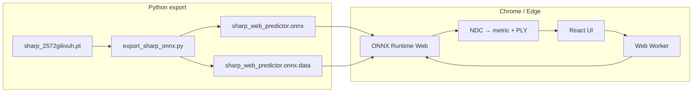

# SHARP → ONNX for the Web

Convert [Apple SHARP](https://apple.github.io/ml-sharp/) (single-image → 3D Gaussian splats) to ONNX and run inference in Chrome via [ONNX Runtime Web](https://onnxruntime.ai/docs/tutorials/web/).

## Architecture




**Why two files?** The SHARP checkpoint is ~2.4 GB. ONNX stores weights in a `.onnx.data` sidecar when the graph exceeds protobuf limits. Both files must be served from the same directory.

**Why NDC postprocessing in JS?** The export emits Gaussians in NDC space. Converting to metric coordinates requires SVD on covariance matrices — done in the worker with a Jacobi eigensolver instead of ONNX `Svd`, which browsers handle poorly.

## License note

SHARP **code** and **model weights** have separate licenses. This repo includes verbatim copies and attribution under `[web/licenses/](web/licenses/)`:

- `[APPLE_SHARP_LICENSE_MODEL](web/licenses/APPLE_SHARP_LICENSE_MODEL)` (weights — **research use only**)
- `[APPLE_ML_SHARP_CODE_LICENSE](web/licenses/APPLE_ML_SHARP_CODE_LICENSE)` (upstream ml-sharp code)
- `[MODEL_DERIVATIVE_NOTICE.md](web/licenses/MODEL_DERIVATIVE_NOTICE.md)` (ONNX exports bundled in `web/public/models/`)

**Attribution (required when redistributing):** *Apple Machine Learning Research Model is licensed under the Apple Machine Learning Research Model License Agreement.*

### Cloning (Git LFS)

Model weight sidecars (`.onnx.data`) use **Git LFS**. The FP32 sidecar (~2.5 GB) is split into two parts under the 2 GB GitHub limit and reassembled on `npm install`.

```bash
git lfs install
git clone https://github.com/pristinaai/Sharp-Onnx-webgpu.git
cd Sharp-Onnx-webgpu
git lfs pull
cd web && npm install && npm run dev
```

## Quick start

### 1. Export ONNX (one-time, ~10–30 min + download)

```bash
chmod +x scripts/setup_export_env.sh
./scripts/setup_export_env.sh

source .venv-export/bin/activate
python scripts/export_sharp_onnx.py \
  --sharp-repo vendor/ml-sharp \
  --output web/public/models/sharp_web_predictor.onnx \
  --verbose
```

Export **both** variants for the browser runtime picker:

```bash
# FP32 — WebGPU on GPUs without float16 shaders (most Linux/NVIDIA setups)
python scripts/export_sharp_onnx.py \
  --sharp-repo vendor/ml-sharp \
  --output web/public/models/sharp_web_predictor.onnx \
  --verbose

# FP16 — WASM fallback, or WebGPU with shader-f16
python scripts/export_sharp_onnx.py \
  --sharp-repo vendor/ml-sharp \
  --output web/public/models/sharp_web_predictor_fp16.onnx \
  --fp16 --verbose
```

### Model / runtime matrix (browser only)


| Your hardware                             | Model                                | Runtime                         |
| ----------------------------------------- | ------------------------------------ | ------------------------------- |
| WebGPU, no `shader-f16` (common on Linux) | **FP32** `sharp_web_predictor.onnx`  | WebGPU                          |
| WebGPU + `shader-f16`                     | FP16 `sharp_web_predictor_fp16.onnx` | WebGPU                          |
| No WebGPU                                 | FP16                                 | WASM (needs ~6 GB RAM, may OOM) |


Optional validation against PyTorch:

```bash
python scripts/validate_onnx.py \
  --sharp-repo vendor/ml-sharp \
  --onnx web/public/models/sharp_web_predictor.onnx
```

### 2. Run the web app

```bash
cd web
npm install
npm run dev
```

Open the URL shown (usually `http://localhost:5173`):

1. **Load model** — fetches ONNX + sidecar (first load can take several minutes).
2. **Upload** a photo.
3. **Generate splat** — runs inference in a Web Worker (WebGPU if available, else WASM).
4. **Download .ply** — open in the [SplatEdit viewer](https://www.splatedit.app/viewer) or any 3D Gaussian splat viewer.

### Requirements


| Component      | Minimum                                                             |
| -------------- | ------------------------------------------------------------------- |
| Export machine | Python 3.10+, ~8 GB RAM, ~5 GB disk                                 |
| Browser        | Chrome/Edge desktop, WebGPU or WASM SIMD                            |
| Runtime RAM    | 8 GB+ recommended (model is large)                                  |
| Node.js        | 18+ (20+ recommended for Vite 7; this repo pins Vite 6 for Node 18) |


## Deploying on Vercel

The app lives in **`web/`**. A root [`vercel.json`](vercel.json) points Vercel at that folder — you do **not** need to set Root Directory manually (or set it to `web` and use [`web/vercel.json`](web/vercel.json) instead).

1. Import the GitHub repo in Vercel.
2. Leave **Root Directory** empty, or set it to **`web`** (both are supported).
3. In **Settings → General → Build & Development Settings**, clear any custom **Install Command** override (leave blank so `vercel.json` applies), or set it to exactly `npm install`.
4. Deploy — install is plain `npm install` (no Git LFS on Vercel; model weights are stripped from the build output).

**Model weights (~4 GB)** exceed Vercel static hosting limits. Production builds strip `.data` / `.part*` from `dist/` and load weights from **[sentiantai/sharp-onnx-webgpu-weights](https://huggingface.co/sentiantai/sharp-onnx-webgpu-weights)** by default. Local `npm run dev` uses bundled files under `web/public/models/` when present.

### Hugging Face weights

Hosted at **[huggingface.co/sentiantai/sharp-onnx-webgpu-weights](https://huggingface.co/sentiantai/sharp-onnx-webgpu-weights/tree/main)** (public model repo).

Production/Vercel uses these URLs automatically. To override, set in **Vercel → Settings → Environment Variables**:

| Name | Value |
|------|--------|
| `VITE_MODEL_URL_FP32` | `https://huggingface.co/sentiantai/sharp-onnx-webgpu-weights/resolve/main/sharp_web_predictor.onnx` |
| `VITE_MODEL_URL_FP16` | `https://huggingface.co/sentiantai/sharp-onnx-webgpu-weights/resolve/main/sharp_web_predictor_fp16.onnx` |

To re-upload or update weights locally:

```bash
pip install -U huggingface_hub
huggingface-cli login

huggingface-cli upload sentiantai/sharp-onnx-webgpu-weights ./web/public/models/sharp_web_predictor.onnx --repo-type model
huggingface-cli upload sentiantai/sharp-onnx-webgpu-weights ./web/public/models/sharp_web_predictor.onnx.data --repo-type model
huggingface-cli upload sentiantai/sharp-onnx-webgpu-weights ./web/public/models/sharp_web_predictor_fp16.onnx --repo-type model
huggingface-cli upload sentiantai/sharp-onnx-webgpu-weights ./web/public/models/sharp_web_predictor_fp16.onnx.data --repo-type model
```

Model card template: [`huggingface/README.md`](huggingface/README.md).

If you still see **404 NOT_FOUND**, confirm the latest deployment succeeded and that Framework Preset is **Vite** (or Other with the commands from `vercel.json`).


## Project layout

```
scripts/
  export_sharp_onnx.py   # PyTorch → ONNX export
  validate_onnx.py       # Compare ONNX vs PyTorch outputs
  setup_export_env.sh    # Clone ml-sharp + create venv
web/
  src/workers/sharpWorker.ts   # ORT inference + postprocess
  src/lib/ply.ts               # SHARP-compatible binary PLY writer
  public/models/               # Place exported .onnx + .onnx.data here
  public/ort/                  # ORT WASM (auto-copied on npm install)
```

## Export options


| Flag           | Default                 | Description                                                        |
| -------------- | ----------------------- | ------------------------------------------------------------------ |
| `--sharp-repo` | (required)              | Path to cloned [apple/ml-sharp](https://github.com/apple/ml-sharp) |
| `--checkpoint` | auto-download           | Local `.pt` checkpoint path                                        |
| `--output`     | `web/public/models/...` | Output ONNX path                                                   |
| `--device`     | `cpu`                   | `cpu`, `cuda`, or `mps`                                            |
| `--opset`      | `20`                    | ONNX opset version                                                 |


## Troubleshooting

`**Failed to load external data file ... .onnx.data**`
Both model files must exist in `web/public/models/` and be served over HTTP (not `file://`).

**WASM magic word error**
Run via `npm run dev`, not by opening HTML directly. Ensure `public/ort/` exists (re-run `npm install`).

`**Failed to get GPU adapter` / WebGPU warning**
WebGPU is optional. The app auto-detects GPU support and falls back to WASM when unavailable (common on Linux VMs, older drivers, or Chrome without WebGPU enabled). Inference still works — it is just slower. To try WebGPU on Chrome: `chrome://flags/#enable-unsafe-webgpu` or use a recent Chrome/Edge on hardware with Vulkan/DirectX 12 support.

`**requires f16` / WebGPU shader error**
Your GPU has WebGPU but not `shader-f16`. Use the **FP32** model — click **Use recommended model** in the app.

`**std::bad_alloc` / ERROR_CODE 6**
WASM ran out of memory. Enable WebGPU and use the **FP32** model so weights run on GPU VRAM instead of the WASM heap.

**Export fails on `gsplat`**
The setup script installs SHARP without `gsplat` (only needed for video rendering, not export).

## References

- [Apple SHARP paper](https://arxiv.org/abs/2512.10685)
- [apple/Sharp on Hugging Face](https://huggingface.co/apple/Sharp)
- [ml-sharp-web](https://github.com/n1ckfg/ml-sharp-web) — prior art for browser SHARP
- [pearsonkyle/Sharp-onnx](https://huggingface.co/pearsonkyle/Sharp-onnx) — community ONNX export

